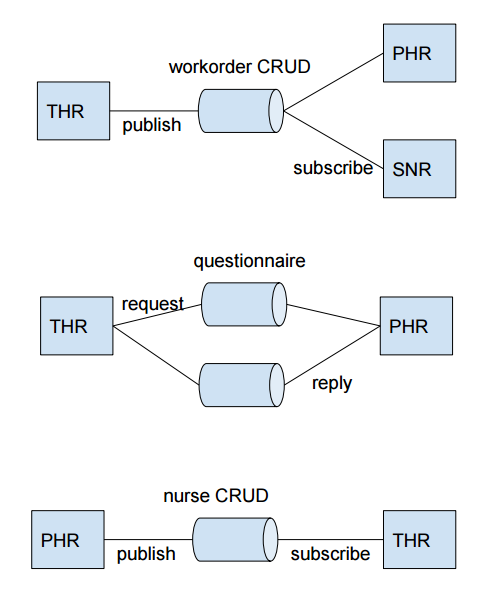

Evergreen Medical
=================

Evergreen Medical on hüpoteetiline kuid realistlik infosüsteem, mis
demonstreerib rakenduste integreerimise põhimõtteid.

Eraldiseisvate näidisrakenduste kood on põhiharus *master*, integratsiooni lisamise näited
harudes *integration-thr*, *integration-phr* ja *integration-snr*.

Enne integreerimist
-------------------

Evergreen Medical infosüsteem koosneb kolmest iseseisvast tootest:

1. **Tööülesannete haldamise rakendus (THR)**. Rakenduse abil saab töötajatele
tööülesandeid määrata ning töötaja saab tööülesandeid täita. Tööülesandel on
asukoht, planeeritud algus- ja lõppaeg. Töötaja saab rakenduses raporteerida
töö tegeliku alguse ja lõpu aja.  
*Platvorm*: Java, Spring Boot, Spring MVC REST, Spring Data JPA, AngularJS (JHipster).

2. **Patsientide hooldamise juhtimise rakendus (PHR)**. Rakenduse abil saab
patsientide ja hooldusõdede andmeid hallata ning tervisekontrolli küsimustikke
koostada.  
*Platvorm*: C#, ASP.NET 6 MVC 5, Entity Framework 7.

3. **Sõnumivahetuse ja navigeerimisrakendus (SNR)**. Rakendus edastab kasutajale
sõnumeid ning näitab marsruuti sõnumiga saadetud asukohta.  
*Platvorm*: JavaScript, Node.js, Socket.io.

Integratsioon
-------------

Tooted tuleb integreerida terviklikuks infosüsteemiks, mis katab järgneva
kasutusloo:

1. Osakonnajuht logib PHRi ning sisestab hooldusõe ja patsiendi andmed.
2. Osakonnajuht koostab PHRis küsimustiku patsiendi tervise kontrollimiseks.
3. Osakonnajuht logib THRi ning määrab hooldusõele tööülesande patsiendi
kodukülastuseks mingil kindlal kuupäeval ning lisab tööülesandele küsimustiku
pealkirja.
4. Hooldusõde kasutab tahvelarvutit ning saab SNRi vahendusel teate uuest
tööülesandest. SNR kuvab marsruudi praegusest asukohast patsiendi elukohta.
5. Hooldusõde avab THRi ning märgib töö alustatuks. THR näitab, et
tööülesandega on seotud küsimustik.
6. Hooldusõde sõidab patsiendi elukohta, täidab koduvisiidi käigus küsimustiku
ning märgib THRis tööülesande täidetuks.

THR mudelid:

* WorkOrder
* Location
* Employee
* Questionnaire

PHR mudelid:

* Nurse
* Patient
* HomeAddress
* Questionnaire

SNR mudelid:

* Message
* Location

Sõnumivahetuse topoloogia
-------------------------

Märkmed
-------

Arutelu märksõnad: *bounded context*, andmete jagamine süsteemide vahel
